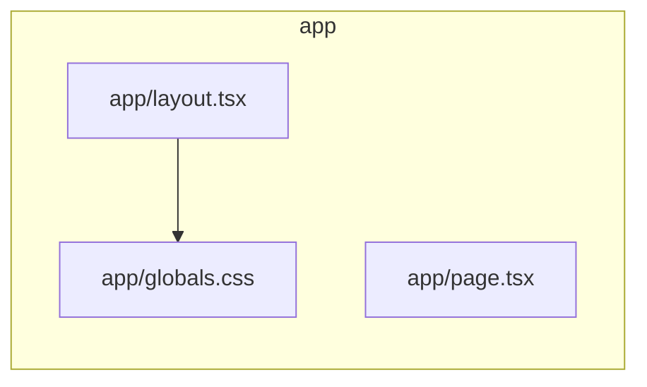

# Grafo de dependencias - Frontend (Next.js)

> Generado automáticamente por `python tools/graph/graph.py build`. No editar a mano.

```mermaid
graph LR
  subgraph app[app]
    src_app_layout_tsx["app/layout.tsx"]
    src_app_globals_css["app/globals.css"]
    src_app_page_tsx["app/page.tsx"]
  end
  src_app_layout_tsx --> src_app_globals_css
```
